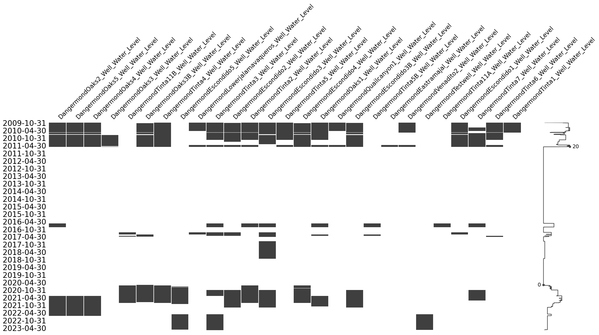
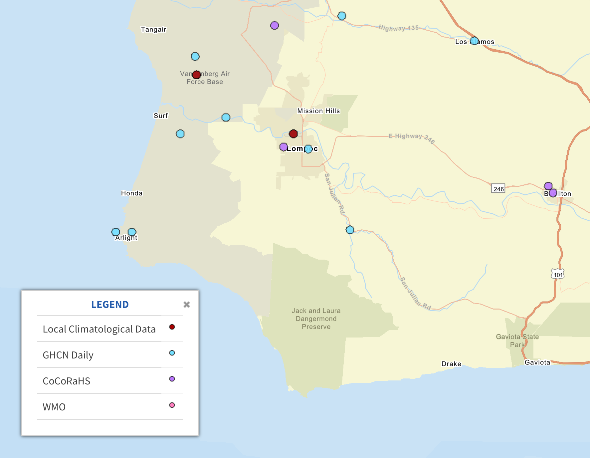

# TNC Dangermond Data Repository

## Overview
This repository contains various datasets related to the Dangermond Preserve, including hydrometeorological data, model forcing data, ngen model output, hydrofabric data, and aggregated summary data used in the Dangermond model explorer web app. The root level folders and subdirectories are described below.

## Directory Structure

### Root Directory (`tnc-dangermond`)
- **all_dangermond_locations.csv**: List of Dangermond Preserve station locations.
- **dangermond_met_locs.png**: Map of meteorological station locations.

### Groundwater Data (`groundwater`)
Contains various groundwater-related datasets. "qc" vars indicate quality control steps applied to raw groundwater level data, defined in `./station_data/lib/groundwater_qc.py`. The CFE ground water level calibration was performed with hourly difference, derived from the raw 15m datalogger files. 

- **gw_catchment_hourly_level_difference/**: Hourly differences in groundwater level.
- **gw_catchment_mean_daily_depth/**: Mean daily depth of groundwater.
- **gw_monthly_delta/**: Monthly groundwater change.
- **gw_qc_pass/**: Quality-controlled groundwater data.

Data availability for groundwater wells during the study period:


### Hydrofabric (`hydrofabric`)
Contains geospatial datasets used for hydrological modeling:
- **jldp_aspect.tif**: Aspect data.
- **jldp_dem.tif**: Digital Elevation Model (DEM).
- **jldp_dinf.tif**: D-infinity flow direction raster.
- **jldp_fac.tif**: Flow accumulation.
- **jldp_fdr.tif**: Flow direction raster.
- **jldp_hydrodem.tif**: Hydrologically corrected DEM.
- **jldp_imp.tif**: Impervious surface raster.
- **jldp_ngen_nhdhr.gpkg**: Hydrofabric dataset for NextGen modeling.
- **jldp_slope.tif**: Slope raster.
- **jldp_twi.tif**: Topographic wetness index (TWI).

### Meteorological Station Data (`met_station_data`)
Contains time series data from various meteorological stations in **Parquet** format.



### Next Generation Hydrologic Model Data (`ngen_dr`)
Contains model calibration, validation, and forcing data:
- **cfe_calib_2024_11_03/**: Calibration results for the CFE model.
- **cfe_calib_valid_2024_10_07/**: Validation dataset for CFE calibration.
- **cfe_valid_2024_11_03/**: CFE model validation results.
- **forcings/**: Meteorological forcing data.
- **lgar_calib_valid_2024_10_07/**: Calibration and validation data for LGAR model.
- **nextgen_hydrofabric_wfp_test.gpkg**: Hydrofabric for NextGen Water Flow Prediction (WFP) tests.
- **output_2024_09_26/**, **output_sim_obs_cfe2.0_itr100/**: Model simulation outputs.

### Hydrofabric Reference Data
- **refactor_hydrofabric.gpkg**: Refactored hydrofabric.
- **reference_hydrofabric.gpkg**: Reference hydrofabric dataset.

### TNC Datastreams (`tnc_datastreams`)
A mirror of the Dangermond dendra data, saved as Parquet files. Data was requested using a refactored version of the Berkeley dendra API wrapper, found at `./station_data/lib/data_loaders.py`. This module implements a `Dendra` class with some but not all functionality found in the orginial code. The stored data includes all available monitoring locations within the Dangermond Preserve. 

### Water Balance Data (`water_balance`)
Contains water balance datasets from different sources:
- **cabcm/**: California Basin Characterization Model (CABCM) water balance components:
  - **aet.parquet**: Actual evapotranspiration.
  - **cwd.parquet**: Climatic water deficit.
  - **pck.parquet**: Precipitation catchment.
  - **pet.parquet**: Potential evapotranspiration.
  - **rch.parquet**: Recharge.
  - **run.parquet**: Runoff.
  - **str.parquet**: Streamflow.
  - **tmn.parquet**: Minimum temperature.
  - **tmx.parquet**: Maximum temperature.
- **terraclim/**: TerraClimate water balance components:
  - **aet.parquet**: Actual evapotranspiration.
  - **def.parquet**: Water deficit.
  - **PDSI.parquet**: Palmer Drought Severity Index.
  - **pet.parquet**: Potential evapotranspiration.
  - **ppt.parquet**: Precipitation.
  - **q.parquet**: Runoff.
  - **soil.parquet**: Soil moisture.
  - **srad.parquet**: Solar radiation.
  - **swe.parquet**: Snow water equivalent.
  - **tmax.parquet**: Maximum temperature.
  - **tmin.parquet**: Minimum temperature.
  - **vap.parquet**: Vapor pressure.
  - **vpd.parquet**: Vapor pressure deficit.
  - **ws.parquet**: Wind speed.
- **tnc/**: Weighted natural flow data.

### Web Application Resources (`webapp_resources`)
Contains datasets used in web applications and visualization tools:
- **cfe_20241103_troute_cat23.parquet**: CFE model routed flow data.
- **cfe_routed_flow_monthly_af.parquet**: Monthly routed flow in acre-feet.
- **cfe_routed_flow_monthly_cfs.parquet**: Monthly routed flow in cubic feet per second.
- **flow_17593507_mean_estimated_1982_2023.csv**: Estimated mean flow dataset.
- **gw_level_raw_hourly_feet.parquet**: Hourly groundwater level data.
- **monthly_gw_delta/**: Monthly groundwater level changes.
- **ngen_validation_20241008_monthly.nc**, **ngen_validation_20241103_monthly.nc**: Validation data for NextGen model.

Code to generated these dataset found at: [Web App Repository](https://link-url-here.org)

### Geographic Data
- **tnc.geojson**: GeoJSON representation of spatial data.

## Usage Examples
- Convienence functions for reading NGEN output files are located in `./station_data/lib/utils.py`, specifically `utils.ngen_csv_to_df()` and `utils.ngen_csv_to_xr()`.

```sh

# create and activate an environment
python3 -m venv tnc_env
source tnc_env/bin/activate  # on Windows, use tnc_env\Scripts\activate

# install dependencies from requirements.txt
pip install -r requirements.txt
```

Examples:
```py
path = "path/to/dir/containg/ngen/csvs"

# load data for single catchment
df = pd.read_csv(os.path.join(path, "cat-31"), index_col=["Time"], parse_dates=["Time"])

# load data for all catchments as individual dataframes
df_lst, cats = utils.ngen_csv_to_df(path)

# load data for all catchments as xarray dataset
ds = utils.ngen_csv_to_xr(path)

# load routed flows (`troute`) as xarray dataset
ds = xr.open_dataset(path/to/troute/output/file.nc)
```


## License
This dataset is provided for research and conservation purposes. Contact **TNC** for permissions regarding use and distribution.

## Contact
For any questions regarding the data, please reach out to **The Nature Conservancy (TNC) Dangermond Preserve Team**.